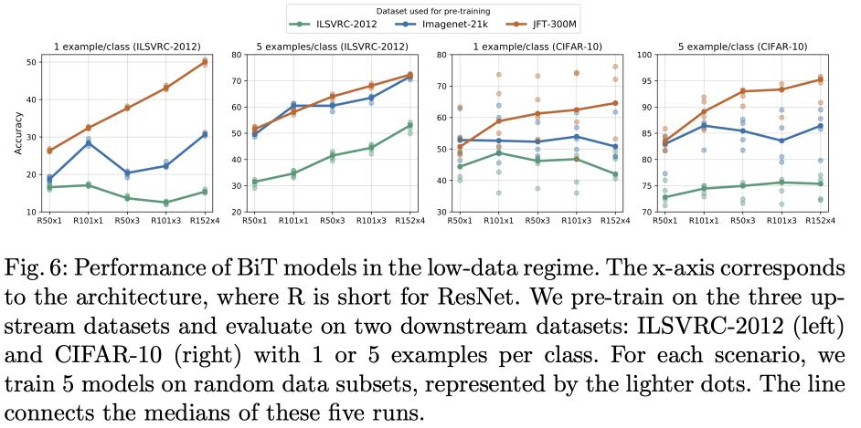

Apply the Big Transfer technique from this repo in CIFAR10 downstream dataset
for 1-10 examples per class (low-data regime). 

Match the behavior of Fig 6 for one upstream dataset of 
your choice and ResNet50-x3 architecture (20 points).




# Steps
## Create virtial env for respective OS and PyTorch

```bash
#from the root of cloned repo
python -m venv .venv
```

## activate and install dependencies

```bash
source .venv/bin/activate

pip install -r bit_pytorch/requirements.txt

```


# Obtaining pre-trained model

## Upstream Tasks
The paper authors provided pre configied and trained models in various sizes and publihsed them.
### Model pre-trained on ILSVRC-2012
For the ResNet50x3 architecture there are two pretrained models present in storage:
- BiT-S-R50x3.npz -- ILSVRC-2012
- BiT-M-R50x3.npz -- ImageNet21K


## Downstream Tasks
During their testing, the paper authors also "tuned" one of the upstream models for downstream tasks.
### Model "Tuned" on ILSVRC2012
This model is first trained on ImageNet21K -- then "tuned" on ILSVRC2012

BiT-M-R50x3-ILSVRC2012.npz

# Experiment
We are using:
- 

```
python3 -m bit_{pytorch|jax|tf2}.train --name cifar10_`date +%F_%H%M%S` --model BiT-M-R50x1 --logdir /tmp/bit_logs --dataset cifar10
```

python -m bit_pytorch.train --name cifar10_$(date +%F_%H%M%S) --model BiT-M-50x3 --datadir ./data --logdir ./logs --dataset cifar10  --bit_pretrained_dir ./models --batch_split 3 --eval_every 1 --examples_per_class_seed 42 --examples_per_class 1 --save 