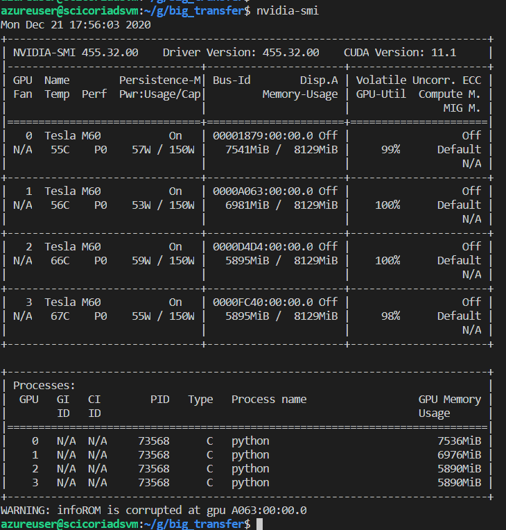

# Overview

As an appendage to the Big Transfer Project, an additional hands on task was available. That task is described as:

Apply the Big Transfer technique from this repo in CIFAR10 downstream dataset for 1-10 examples per class (low-data regime). Match the behavior of Fig 6 for one upstream dataset of your choice and ResNet50-x3 architecture (20 points).

## Figure 6 from the Paper

The following is the image from the referenced paper. For this exercise the focus is on utilizing an existing pre-trained model – specifically the ResNet50-x3.

## Background

## Obtaining pre-trained model

### Upstream Tasks

The paper authors provided pre-configured and trained models in various sizes and published them. These are tagged based upon the base dataset

-   BiT-S

-   BiT-M

-   BiT-L

These each use a different underlying public data set.

### Model pre-trained for download

For the ResNet50x3 architecture there are two pretrained models present in storage:

1.  BiT-S-R50x3.npz -- ILSVRC-2012

2.  BiT-M-R50x3.npz -- ImageNet21K

We are using the model: BiT-M-R50x3 – this is retrieved using `wget`.

~~~~~~~~~~~~~~~~~~~~~~~~~~~~~~~~~~~~~~~~~~~~~~~~~~~~~~~~~~~~~~~~~~~~~~~~~~~~~~~~
wget https://storage.googleapis.com/bit_models/BiT-M-R50x1.{npz|h5}
~~~~~~~~~~~~~~~~~~~~~~~~~~~~~~~~~~~~~~~~~~~~~~~~~~~~~~~~~~~~~~~~~~~~~~~~~~~~~~~~

Since PyTorch is used, the npz version (numpy compressed archive) is used:

~~~~~~~~~~~~~~~~~~~~~~~~~~~~~~~~~~~~~~~~~~~~~~~~~~~~~~~~~~~~~~~~~~~~~~~~~~~~~~~~
wget https://storage.googleapis.com/bit_models/BiT-M-R50x1.npz
~~~~~~~~~~~~~~~~~~~~~~~~~~~~~~~~~~~~~~~~~~~~~~~~~~~~~~~~~~~~~~~~~~~~~~~~~~~~~~~~

# Requirements

This experiment was run on an Azure Virtual Machine specifically for Data Science Workload.

Azure SKU: Standard NV24_Promo (24 vcpus, 224 GiB memory)

-   Linux Ubuntu 18.04

-   NVIDIA CUDA drivers

-   NVIDUA Tesla GPUs

-   24 Virtual CPUs

-   224 GiB memory

# Repository

The clone of the Big Transfer repository with the bits described here is at:

<https://github.com/cicorias/big_transfer>

# Getting Started

## Clone the Repository

First clone the full repo locally or to machine of your choice:

~~~~~~~~~~~~~~~~~~~~~~~~~~~~~~~~~~~~~~~~~~~~~~~~~~~~~~~~~~~~~~~~~~~~~~~~~~~~~~~~
git clone 
~~~~~~~~~~~~~~~~~~~~~~~~~~~~~~~~~~~~~~~~~~~~~~~~~~~~~~~~~~~~~~~~~~~~~~~~~~~~~~~~

### Create virtual env for respective OS and PyTorch

~~~~~~~~~~~~~~~~~~~~~~~~~~~~~~~~~~~~~~~~~~~~~~~~~~~~~~~~~~~~~~~~~~~~~~~~~~~~~~~~
#from the root of cloned repo
python -m venv .venv
~~~~~~~~~~~~~~~~~~~~~~~~~~~~~~~~~~~~~~~~~~~~~~~~~~~~~~~~~~~~~~~~~~~~~~~~~~~~~~~~

### Activate Python venv

~~~~~~~~~~~~~~~~~~~~~~~~~~~~~~~~~~~~~~~~~~~~~~~~~~~~~~~~~~~~~~~~~~~~~~~~~~~~~~~~
source .venv/bin/activate
~~~~~~~~~~~~~~~~~~~~~~~~~~~~~~~~~~~~~~~~~~~~~~~~~~~~~~~~~~~~~~~~~~~~~~~~~~~~~~~~

### Install Dependencies

~~~~~~~~~~~~~~~~~~~~~~~~~~~~~~~~~~~~~~~~~~~~~~~~~~~~~~~~~~~~~~~~~~~~~~~~~~~~~~~~
pip install -r bit_pytorch/requirements.txt
~~~~~~~~~~~~~~~~~~~~~~~~~~~~~~~~~~~~~~~~~~~~~~~~~~~~~~~~~~~~~~~~~~~~~~~~~~~~~~~~

### Change to the `./src `subdirectory

~~~~~~~~~~~~~~~~~~~~~~~~~~~~~~~~~~~~~~~~~~~~~~~~~~~~~~~~~~~~~~~~~~~~~~~~~~~~~~~~
cd ./src
~~~~~~~~~~~~~~~~~~~~~~~~~~~~~~~~~~~~~~~~~~~~~~~~~~~~~~~~~~~~~~~~~~~~~~~~~~~~~~~~

### Retrieve the pre-trained model

Note: This MUST be done from within the `./src` directory

~~~~~~~~~~~~~~~~~~~~~~~~~~~~~~~~~~~~~~~~~~~~~~~~~~~~~~~~~~~~~~~~~~~~~~~~~~~~~~~~
wget 
~~~~~~~~~~~~~~~~~~~~~~~~~~~~~~~~~~~~~~~~~~~~~~~~~~~~~~~~~~~~~~~~~~~~~~~~~~~~~~~~

## Run the experiment script

This script runs two sets of five iterations in order to match the number of test runs for a single image from 1 class each, and 5 images from each class as shown from Figure 6 and explained in the paper.

~~~~~~~~~~~~~~~~~~~~~~~~~~~~~~~~~~~~~~~~~~~~~~~~~~~~~~~~~~~~~~~~~~~~~~~~~~~~~~~~
./run_model.sh
~~~~~~~~~~~~~~~~~~~~~~~~~~~~~~~~~~~~~~~~~~~~~~~~~~~~~~~~~~~~~~~~~~~~~~~~~~~~~~~~

While the model is running any output is also written to log files in the `{root}/logs` directory. That output contains the top-1 % accuracy and loss during validation for that run. It is that metric we need to reproduce and compare our results with the paper.

Each subdirectory is named after the run from the bash script and contains the log file along with a persisted saved state of the model at last validation.

Below you can see log files for the CIFAR10 with 1 class, and CIFAR10 with 5 classes.

## Batch Script

The following batch script runs the Big Transfer modules for Pytorch using the CIFAR10 data set for training and validation. 

The only difference between the two blocks is that the first uses a “single” image from each class; the second block uses “five” images from each class for training.

## Batch Split

Since the run was on a 4 GPU machine with 8GiB each card, the parameters for PyTorch batching had to be applied. Not providing or less than 4 (2 for example) crashed with an out of GPU memory issue. When running on a 4 GPU machine this has to be set to 8 – so, there is a correlation (negative) between batch and number of GPUs. This is something advised by the authors of the paper

## Eval Every

This just emits a validation of the data using the validation data set.

## Examples Per Class [seed]

To correlate with the Figure 6 reproduction, this is the setting that drives “1 item per class” and “5 items per class” for training. You will see that the Validation of training uses a much larger value.

The seed value is there for reproducibility within my experiment. Probably could have left it blank to achieve better randomization, but since I was looking for consistency and reproducing the results each iteration uses a different seed. So, 10 overall iterations with 10 seeds. 

## Log Files

For each run, the logging provides a dump of the hyper-parameters used. These logs files are needed to get the validation accuracy for comparison. 

### Images per class

Note that for this run (which is 1st of 10) 1 image per class; since this is CIFAR10, that translates to 10 images overall

### Training set size and Validation

Again, 1 image per class and CIFAR10 with 10 classes results in 10 images – a VERY small training set; validation is set to 10,000

### Model

As required the model specified is BiT-M-R50x3

# Goal

When reviewing the graphs from Figure 6 in the paper:

The subset of the overall paper’s work that this is focused on is Pretrained on Imagenet-21k – that is the Bit-M models.

Then “fine-tuning” with the R50x3 sub model from Bit-M – that is Bit-M-R50x3 – and that is the one shown in the steps for download via wget.

So, more specifically, we are looking to reproduce on each graph below the “5 dots” that are within the R50x3 x-axis column wrapped in green below – and specifically for the “dark blue line” that corresponds to pre-training on Imagenet-21k.

As we can approximate the accuracy values for the average (which is what the line graph in dark blue cuts through. 

-   1 example / class \~= 52

-   5 examples / class \~= 85

# Results

In each log, 10 overall (5 for 1 example/class; 5 for 5 example/class) at the bottom we use the “top1” value.

**Note** that the code base is modified to shorten the iterations, since such a low number of training cases, in addition as it was observed that convergence happened quite early, no where near 500, the learning rate was reduced from 0.003 to 0.001. 

**The learning rate change seemed to have a small positive impact on the 1 item per class training accuracy by a few points – from the papers 52 to this runs 56.462 – and small improvement of 4.462 points (approximately).**

### Table

The following is the results with the average as the last row

|         | 1Ex    | 5Ex    |
|---------|--------|--------|
|         | 58.83  | 86.21  |
|         | 58.01  | 83.98  |
|         | 48.34  | 82.69  |
|         | 62.96  | 84.61  |
|         | 54.17  | 87.54  |
| average | 56.462 | 85.006 |
| old avg | 52     | 85     |

We can see for the 1 example per class much greater variation, but for the 5 examples per class the average of the accuracies is nearly identical.

### Graph

The two graphs show the results below.

First graph is the 1 item per class showing the new mean and the old mean.

1 example per class

5 examples per class

# Notes on running

The source code from Big Transfer was modified to shorten the length of a run if the number of classes, dataset size is small. This was done in:

Normally, the code base had no early exit, or early stopping when the loss change was near zero or negligible.

In testing it was noticed that with the default learning rate of 0.003 and such small training sets convergence happened in far less than 100 iterations, with a PyTorch batch of 4. In fact, it was converging around 20.

Appendix NVIDIA consumption - 

~~~~~~~~~~~~~~~~~~~~~~~~~~~~~~~~~~~~~~~~~~~~~~~~~~~~~~~~~~~~~~~~~~~~~~~~~~~~~~~~
+-----------------------------------------------------------------------------+
| NVIDIA-SMI 455.32.00    Driver Version: 455.32.00    CUDA Version: 11.1     |
|-------------------------------+----------------------+----------------------+
| GPU  Name        Persistence-M| Bus-Id        Disp.A | Volatile Uncorr. ECC |
| Fan  Temp  Perf  Pwr:Usage/Cap|         Memory-Usage | GPU-Util  Compute M. |
|                               |                      |               MIG M. |
|===============================+======================+======================|
|   0  Tesla M60           On   | 00001879:00:00.0 Off |                  Off |
| N/A   55C    P0    57W / 150W |   7541MiB /  8129MiB |     99%      Default |
|                               |                      |                  N/A |
+-------------------------------+----------------------+----------------------+
|   1  Tesla M60           On   | 0000A063:00:00.0 Off |                  Off |
| N/A   56C    P0    53W / 150W |   6981MiB /  8129MiB |    100%      Default |
|                               |                      |                  N/A |
+-------------------------------+----------------------+----------------------+
|   2  Tesla M60           On   | 0000D4D4:00:00.0 Off |                  Off |
| N/A   66C    P0    59W / 150W |   5895MiB /  8129MiB |    100%      Default |
|                               |                      |                  N/A |
+-------------------------------+----------------------+----------------------+
|   3  Tesla M60           On   | 0000FC40:00:00.0 Off |                  Off |
| N/A   67C    P0    55W / 150W |   5895MiB /  8129MiB |     98%      Default |
|                               |                      |                  N/A |
+-------------------------------+----------------------+----------------------+
                                                                               
+-----------------------------------------------------------------------------+
| Processes:                                                                  |
|  GPU   GI   CI        PID   Type   Process name                  GPU Memory |
|        ID   ID                                                   Usage      |
|=============================================================================|
|    0   N/A  N/A     73568      C   python                           7536MiB |
|    1   N/A  N/A     73568      C   python                           6976MiB |
|    2   N/A  N/A     73568      C   python                           5890MiB |
|    3   N/A  N/A     73568      C   python                           5890MiB |
+-----------------------------------------------------------------------------+
~~~~~~~~~~~~~~~~~~~~~~~~~~~~~~~~~~~~~~~~~~~~~~~~~~~~~~~~~~~~~~~~~~~~~~~~~~~~~~~~
